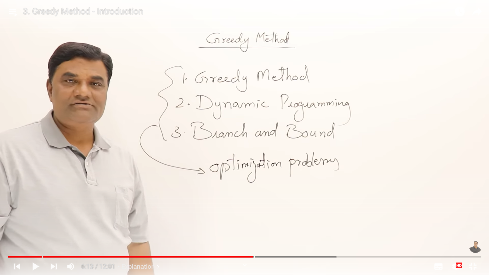

# Greedy Algorithm

- [Wikipedia](https://en.wikipedia.org/wiki/Greedy_algorithm)

- [Abdul Bari Sir](https://www.youtube.com/watch?v=ARvQcqJ_-NY&list=PLDN4rrl48XKpZkf03iYFl-O29szjTrs_O&index=39)

Greedy Method is one of the methods to solve optimization (either minimization or maximization) problems.
