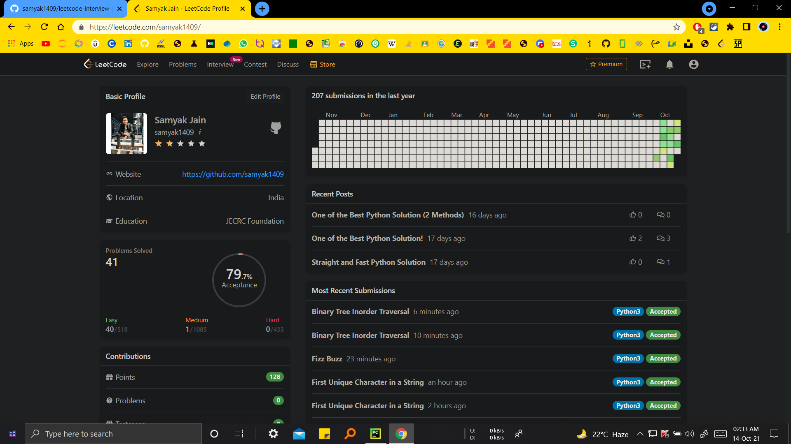
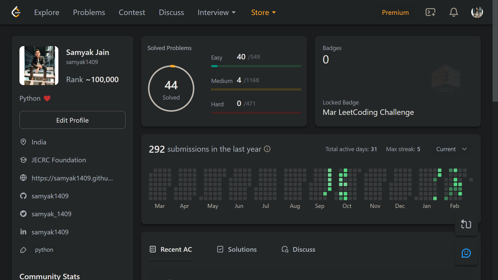

# [LeetCode](https://leetcode.com) Interview-Preparation

This repository contains the code solutions to [LeetCode's Top Interview Questions](https://leetcode.com/problemset/all/?listId=wpwgkgt&sorting=W3sic29ydE9yZGVyIjoiREVTQ0VORElORyIsIm9yZGVyQnkiOiJBQ19SQVRFIn1d).

## Features

- Complete Code-Explanations 🙌
- Properly Formatted Codes ([PEP 8](https://www.python.org/dev/peps/pep-0008) ✔)
- Readability 👌 (good variable names and descriptive comments)
- Multiple Approaches 🔥
- Complexity Analysis 🕐

##

### [LeetCode Profile](https://leetcode.com/samyak1409) Timeline

- After completing [Easy](https://leetcode.com/problemset/all/?listId=wpwgkgt&difficulty=EASY&sorting=W3sic29ydE9yZGVyIjoiREVTQ0VORElORyIsIm9yZGVyQnkiOiJBQ19SQVRFIn1d)

- After revising [Easy](https://leetcode.com/problemset/all/?listId=wpwgkgt&difficulty=EASY&sorting=W3sic29ydE9yZGVyIjoiREVTQ0VORElORyIsIm9yZGVyQnkiOiJBQ19SQVRFIn1d)

