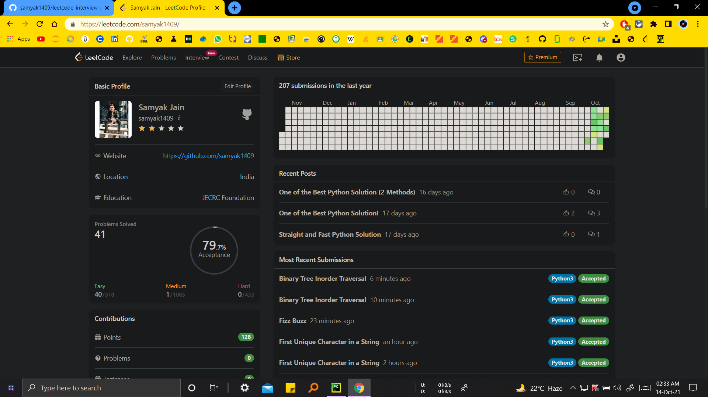

# LeetCode Interview-Preparation

Solutions to LeetCode's Top Interview Questions.

## Features

- Properly Formatted Codes ([PEP 8](https://www.python.org/dev/peps/pep-0008/) ✔)
- Multiple Approaches 🔥
- Readability ❤ (Good variable names and comments!)
- Complexity Analysis 🕐

## 

### [LeetCode Profile](https://leetcode.com/samyak1409/) Timeline

- After completing [Easy](Top%20Interview%20Questions/Easy)

